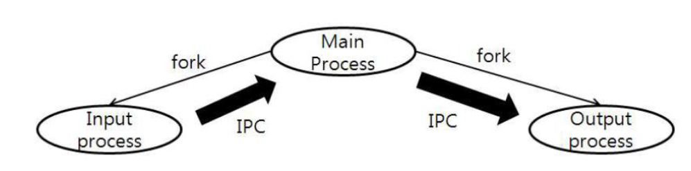

# Project 1

## Description
Implement Clock, Counter, Text editor, Draw board  
using device control, IPC

## Usage
Create 'EXE.mk' file at 'src' and set program name at variable named EXE 
```
EXE = <PROGRAM NAME>
```
Then make project and run it
```
$ make
$ ./<PROGRAM NAME>
```

## Implementation
This program has 3 processes: Main process, Input process and Output process  
Input process and Output process are forked from Main process  
Use Shared memory IPC with semaphore for communication


### Role of processes
* Input process  
  Get input from input devices: readkey, push switch. Send data to Main process.
* Main process  
  Carry out main functionalities for each modes. Send data to Output process.
* Output process  
  Set data to output devices: FND, LED, Dot Matrix, Text LCD

### Mode
* Clock: Output the current time at FND and set time using push switch
* Counter: Output the counted number
* Text Editor: Ouput the text obtained from switches at Text LCD
* Draw Board: Output the board at Dot Matrix
  
### Device Control
Use device drivers. Use mmap() for LED control only.

### IPC
Use shared memory. Use semaphore to solve Producer Consumer Problem.


## Implementation Details
### Set 'property'
Three processes need some data to be shared: file descriptors (since both Input process and Output process use those.)  
Created struct property at 'process.h' to share this data rather than using shared memory because this data won't be changed.
When program starts, set property and then Main process forks. That way, three processes have the same data as they start.
```c
struct property {
        int ev_fd, fnd_fd, push_switch_fd, dot_fd, text_lcd_fd;
} prop;
```

### Hide functions
Tried to simluate encapsulation in C.
Use semaphore only at shared memory functions. When creating shared memory, semaphores are set automatically. Don't use semaphore at other functions.

### Use function pointer for changing modes
Main process change modes by switching function pointer values.

### Use thread for flicker at Clock mode
When setting time, LED should be flicking. To flick LED, set LED value and then sleep for a sec. But main process should be awake to manage other inputs.
So create flicker thread instead.

### Allow 'make' to be executed anywhere
At every directory, create Makefile and include the main mk file.

## Feed back
### Improve memory usage
Currently, each process copies data from shared memory. But advantage of shared memory over message queue is memory efficiency. So instead of copying data, use data directly from shared memory.

### Improve robustness
To manage massive amount of input, process should be able to process input data sequentially.